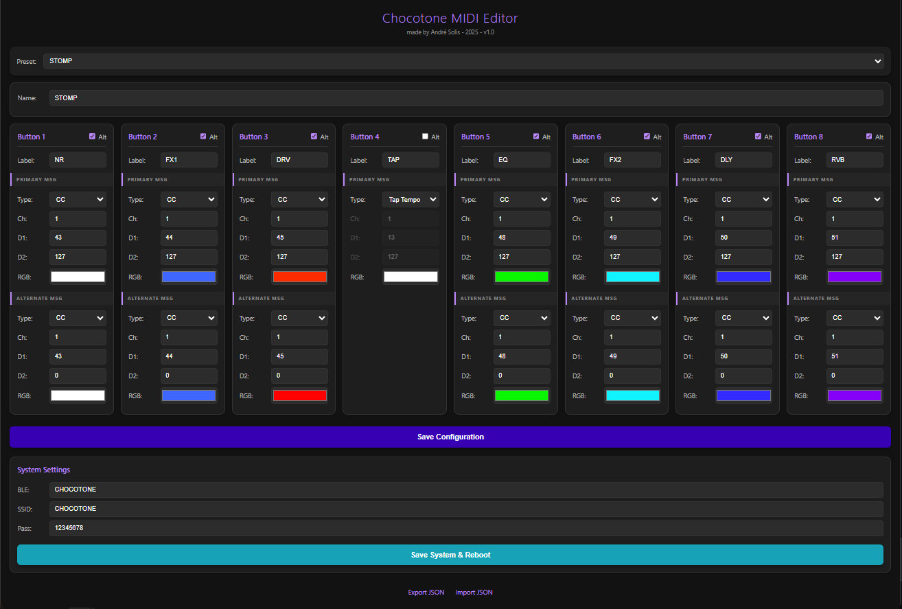
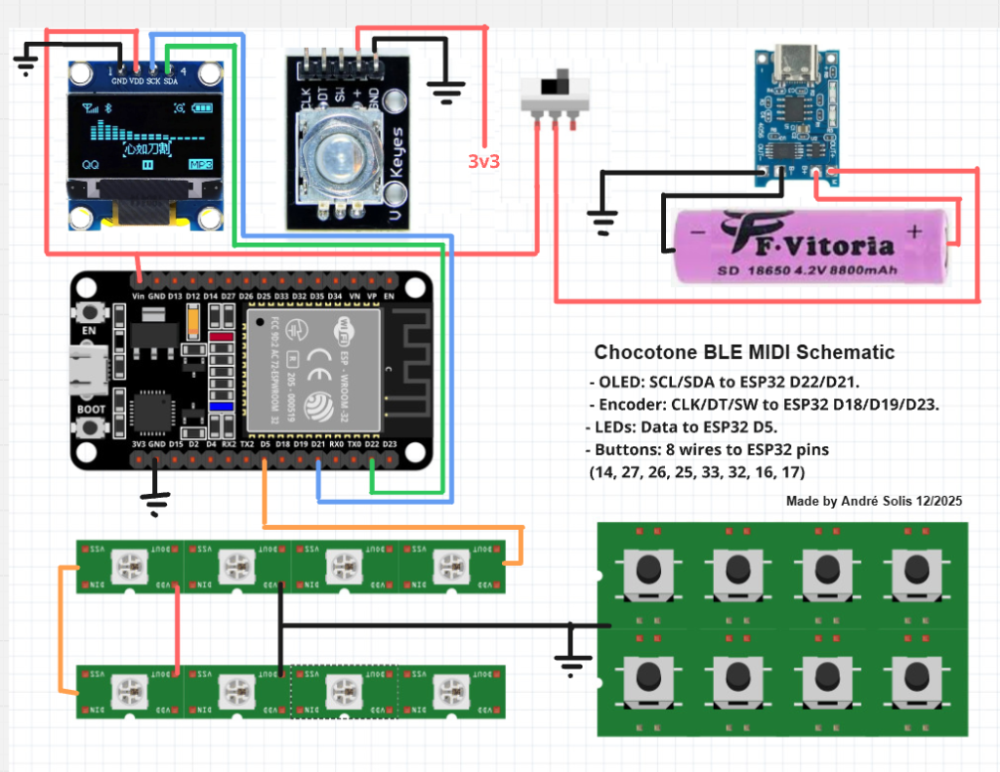

# Chocotone MIDI Controller


**A powerful, customizable ESP32-based BLE MIDI controller designed for wireless control of BLE MIDI devices like the Sonicake Pocket Master.**

[](LICENSE)
[](https://www.espressif.com/en/products/socs/esp32)
[](https://www.arduino.cc/)

---


## Features

### Hardware
- **8 Programmable Buttons** - MIDI messages with LED feedback per button
- **OLED Display (128x64)** - Real-time status, preset names, and menu system
- **Rotary Encoder** - Navigation and parameter adjustment
- **NeoPixel LEDs** - Visual feedback with customizable colors and brightness
- **WiFi Access Point** - Wireless configuration via web browser

### MIDI Capabilities
- **BLE MIDI Client** - Connects wirelessly to BLE MIDI devices (e.g., Sonicake Pocket Master)
- **Multiple Message Types** - Note On/Off, CC, Program Change, SysEx
- **Tap Tempo** - Built-in tap tempo with rhythm patterns (1/8, 1/8d, 1/4, 1/2)
- **4 Presets** - Store and recall different button configurations
- **Alternate Messages** - Toggle between two MIDI messages per button

### Configuration & Management
- **Web Interface** - Edit MIDI mappings, button names, and settings via browser
- **Export/Import** - Backup and restore configurations as JSON
- **NVS Storage** - All settings persist across power cycles



---

## Hardware Requirements

> [!NOTE]
> Two hardware variants are available: **Desktop Version** (tactile buttons) and **Floor Pedal Version** (footswitches). See [HARDWARE.md](docs/HARDWARE.md) for complete BOM for each variant.

### Core Components
| Component | Specification | Notes |
|-----------|---------------|-------|
| Microcontroller | ESP32 (any variant with BLE) | Tested with ESP32-DevKitC |
| OLED Display | 128x64 I2C SSD1306 | 0.96" typical |
| Rotary Encoder | Standard EC11 type | With push button |
| NeoPixel LEDs | WS2812B strip/ring | 8 individual LEDs |
| Buttons | Tactile switches | 8 required |

### Pin Connections

See [docs/WIRING.md](docs/WIRING.md) for detailed wiring diagrams.



```
Component          | ESP32 Pin | Notes
-------------------|-----------|------------------
OLED SDA           | GPIO 21   | I2C Data
OLED SCL           | GPIO 22   | I2C Clock
Encoder A          | GPIO 18   | 
Encoder B          | GPIO 19   | 
Encoder Button     | GPIO 23   | INPUT_PULLUP
NeoPixel Data      | GPIO 5    | 
Button 1           | GPIO 14   | INPUT_PULLUP
Button 2           | GPIO 27   | INPUT_PULLUP
Button 3           | GPIO 26   | INPUT_PULLUP
Button 4           | GPIO 25   | INPUT_PULLUP
Button 5           | GPIO 33   | INPUT_PULLUP
Button 6           | GPIO 32   | INPUT_PULLUP
Button 7           | GPIO 16   | INPUT_PULLUP
Button 8           | GPIO 17   | INPUT_PULLUP
```

### Power Consumption

Typical power requirements:

| Component | Current Draw | Notes |
|-----------|--------------|-------|
| ESP32 (WiFi off) | ~80mA | BLE active |
| ESP32 (WiFi on) | ~160-240mA | Peak during transmission |
| OLED Display | ~20mA | Active display |
| NeoPixels (8 LEDs) | Up to 480mA | 60mA per LED at full white |
| **Total (typical)** | **~300-400mA** | Normal operation |
| **Total (max)** | **~750mA** | All LEDs full brightness + WiFi |

**Power Supply Requirements:**
- USB 5V, 2A recommended for desktop use
- For battery operation: 3.7V LiPo with boost converter, 2000mAh+ capacity
- Consider separate 5V supply if using high-brightness LED modes

## Software Dependencies

### Required Arduino Libraries
Install via Arduino Library Manager or PlatformIO:

```
Adafruit GFX Library @ ^1.11.0
Adafruit SSD1306 @ ^2.5.0
Adafruit NeoPixel @ ^1.10.0
ESP32Encoder @ ^0.10.0
ArduinoJson @ ^6.21.0
```

### ESP32 Board Support
- Arduino-ESP32 core version 2.0.0 or later
- Install via Arduino IDE Board Manager: "esp32 by Espressif Systems"

## Installation & Setup

### 1. Hardware Assembly
- Wire components according to [docs/WIRING.md](docs/WIRING.md)
- Ensure proper power supply for NeoPixels (5V, adequate current)
- Use appropriate resistors for input-only GPIO pins

### 2. Software Setup

#### Arduino IDE
```bash
1. Install ESP32 board support
2. Install required libraries (see above)
3. Open Chocotone/Chocotone.ino
4. Select your ESP32 board from Tools > Board
5. Select COM port from Tools > Port
6. Upload to ESP32
```

#### PlatformIO
```bash
1. Open project folder
2. Build: pio run
3. Upload: pio run --target upload
```

### 3. Initial Configuration

1. **Power on the controller** - Should display "Starting..." then default preset
2. **Access WiFi settings**:
   - Long-press encoder button to enter menu
   - Navigate to "Wi-Fi Config"
   - Short-press to enable WiFi
3. **Connect to WiFi**:
   - Look for network: `ESP32_MIDI_Config`
   - Password: `12345678` (change via web interface)
4. **Open web interface**:
   - Navigate to: `http://192.168.4.1`
   - Configure MIDI mappings and settings

> [!IMPORTANT]
> Change the default WiFi password via the web interface for security:
> 1. Connect to WiFi and open http://192.168.4.1
> 2. Go to the **Settings** tab
> 3. Update "WiFi Password" field
> 4. Click "Save Settings"

## Usage Guide

### Button Operation
- **Short Press** - Send primary MIDI message
- **Long Press** - Toggle alternate message (if configured)
- **LED Feedback** - Bright when active, dim when inactive

### Encoder Operation
- **Rotate** - Navigate menu, adjust parameters
- **Short Press** - Select menu item, confirm
- **Long Press** - Enter/exit menu

### Tap Tempo
1. Assign TAP_TEMPO message type to any button
2. Press button to enter tap tempo mode
3. Tap repeatedly to set tempo
4. Rotate encoder to adjust BPM (±0.5 per click)
5. Short-press encoder to cycle rhythm patterns
6. Auto-exits after 3 seconds of inactivity

### Presets
- 4 presets available (selected in code or via encoder)
- Each preset stores:
  - 8 button configurations
  - Custom preset name
  - MIDI mappings and colors

### Web Interface

Access at `http://192.168.4.1` when WiFi is enabled:

- **Buttons Tab** - Configure MIDI mappings for all buttons
- **Settings Tab** - System settings (BLE name, WiFi credentials, LED brightness)
- **Export/Import** - Backup and restore configurations

### Menu System

Long-press encoder to access:
- **Save and Exit** - Save changes and return to preset mode
- **Exit without Saving** - Discard changes
- **Wi-Fi Config** - Toggle WiFi on/off
- **LED Bright (On/Dim)** - Adjust brightness levels
- **Pad Debounce** - Adjust button debounce timing
- **Clear BLE Bonds** - Reset Bluetooth pairings
- **Reboot** - Restart the controller
- **Factory Reset** - Restore default settings

## BLE Connection

The controller operates as a **BLE MIDI client only** and automatically:
1. Scans for nearby BLE MIDI devices
2. Connects to discovered devices (e.g., "SPM" for Sonicake Pocket Master)
3. Reconnects automatically if disconnected

Connection status shown on OLED: `SPM:Y` (connected) or `SPM:N` (disconnected)

## Troubleshooting

### Controller won't boot
- Check power supply (3.3V stable for ESP32)
- Verify OLED connections (I2C)
- Check Serial Monitor for error messages

### BLE won't connect
- Use "Clear BLE Bonds" from menu
- Reboot both controller and target device
- Ensure target device is in pairing mode
- Check Serial Monitor for connection logs

### Buttons not responding
- Adjust debounce timing in menu
- Verify button wiring (pull-up resistors for GPIO 34/35)
- Check button configuration in web interface

### LEDs not working
- Verify NeoPixel data pin connection (GPIO 5)
- Ensure adequate 5V power supply
- Check LED brightness settings in menu

## Project Structure

```
Chocotone/
├── Chocotone.ino        # Main Arduino sketch
├── Config.h             # Pin definitions and constants
├── Globals.h/cpp        # Global variables and objects
├── BleMidi.h/cpp        # BLE MIDI client implementation
├── Input.h/cpp          # Button and encoder handling
├── Storage.h/cpp        # NVS persistence
├── UI_Display.h/cpp     # OLED display functions
├── WebInterface.h/cpp   # Web server and configuration
├── sys_ex_data.h/cpp    # Generated SysEx data
└── delay_time_sysex.h   # Tap tempo delay lookups
```

## Development

### Utility Scripts

See [scripts/README.md](scripts/README.md) for development tools:
- SysEx data generation
- Header file creation
- BLE debugging utilities

### Older Versions

Archived versions (v7, v8) available in [archive/](archive/) for reference.

## License

This project is licensed under the MIT License - see the [LICENSE](LICENSE) file for details.

## Contributing

Contributions welcome! Please read [CONTRIBUTING.md](CONTRIBUTING.md) for guidelines.

## Acknowledgments

- Built on ESP32 Arduino core
- Uses Adafruit libraries for display and LEDs
- Inspired by the need for flexible MIDI control of Sonicake Pocket Master pedals

## Support

- **Issues**: Please open a GitHub issue for bugs or feature requests
- **Discussions**: Use GitHub Discussions for questions and ideas

---

**Happy MIDI controlling!** 🎵🎛️
