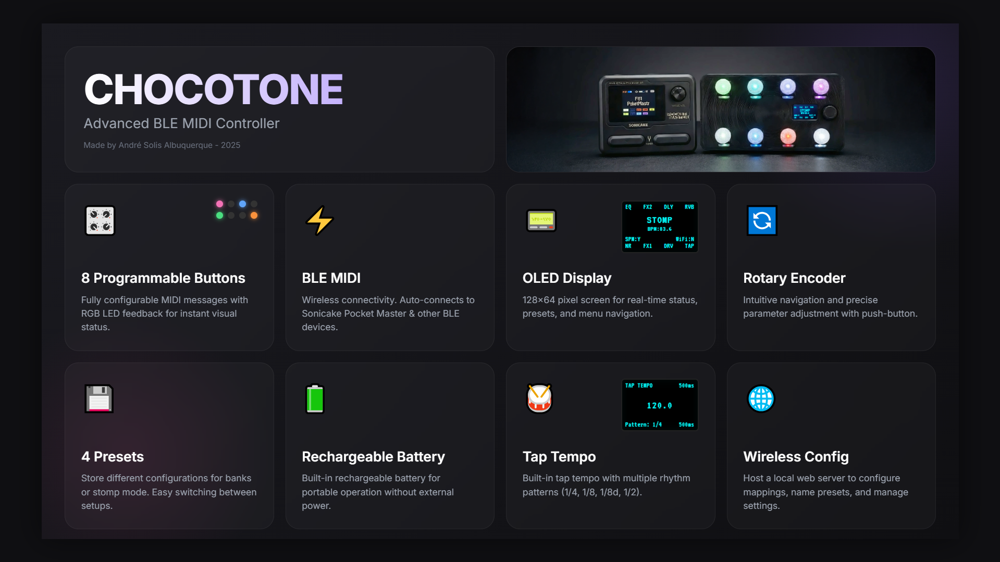
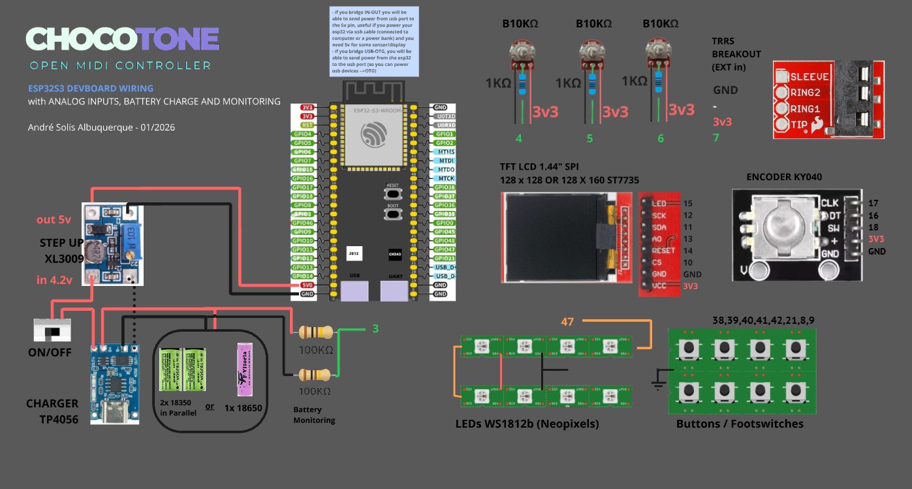

# Chocotone MIDI Controller


**A powerful, open-source ESP32 and ESP32-S3 based MIDI controller. Configurable via web browser, supporting BLE MIDI and Native USB MIDI.**

> [!NOTE]
> 


[](LICENSE)
[](https://www.espressif.com/en/products/socs/esp32)
[](https://www.arduino.cc/)

> 🎸 **Join our community!** Get help, share your build, and connect with other makers in our [Facebook Group](https://www.facebook.com/groups/1950814575859830/)

---



## 🚀 Easy Install (No Coding Required!)

**New to ESP32?** Use our web-based installer to flash the firmware directly from your browser!

### [🚀 Open Web Installer](https://solispensa.github.io/Chocotone/web_tools/installer.html) | [📘 Beginner's Guide](docs/BEGINNER_GUIDE.md)

| | |
|---|---|
| 👉 **[Chocotone Web Installer](https://solispensa.github.io/Chocotone/web_tools/installer.html)** | Flash firmware in one click |
| 🎛️ **[Chocotone Editor](https://solispensa.github.io/Chocotone/chocotone_midi_editor.html)** | Configure buttons and MIDI via USB and Bluetooth |
| 📖 **[Beginner's Guide](docs/BEGINNER_GUIDE.md)** | Step-by-step tutorial |

**Requirements:** Chrome/Edge/Brave browser • USB cable • ESP32 board

---

## Features

### Hardware
- **ESP32-S3 Support (v1.5)** - Native USB MIDI support for lower latency and direct DAW connection
- **Up to 16 Programmable Buttons** - Configurable button count with MIDI messages and LED feedback
- **OLED Display (128x64/128x32)** - Real-time status, preset names, and menu system  
- **Rotary Encoder** - Navigation and parameter adjustment
- **NeoPixel LEDs** - Visual feedback with customizable colors and brightness
  - Tap tempo blink feedback on all LEDs
- **WiFi Access Point** - Wireless configuration via web browser
- **Analog Inputs (v1.5)** - Up to 16 analog inputs for expression pedals, pots, FSRs, piezo, switches
  - Direct GPIO support or multiplexer (CD74HC4067/CD74HC4051)
  - Configurable signal processing: oversampling, EMA smoothing, hysteresis
  - Custom response curves: Linear, Logarithmic, or Exponential
  - Multi-message support with input/output range mapping
- **128x128 TFT SPI Color Display (v1.5)** - Full-color display showing color stripes for each control
- **Battery Monitoring (v1.5)** - Voltage divider for Li-ion battery tracking

### MIDI Capabilities
- **Native USB MIDI (v1.5)** - Direct connection via USB on ESP32-S3 boards
- **BLE MIDI Dual-Mode** - Connect to BLE devices AND accept connections from DAWs/Apps
  - CLIENT mode: Connect to external BLE MIDI devices (e.g., Sonicake Pocket Master)
  - SERVER mode: Accept connections from DAWs, mobile apps, or other BLE MIDI hosts
  - DUAL mode: Both client and server active simultaneously
- **SysEx Scroll Commands (v1.5)** - Control complex parameters on Sonicake Pocket Master (Valeton GP5 in testing)
  - **Whammy Mode for Pocket Master!** Use an expression pedal for PITCH - HIGH (0 to +24) and PITCH - LOW (-24 to 0) to play solos like Audioslave's "Like a Stone" for free! 🎸
  - Supports: DRV - GAIN, DLY - FBK, FX1 - RATE, RVB - MIX, AMP - GAIN
- **Multiple Message Types** - Note On/Off, CC, Program Change, SysEx
- **Tap Tempo** - Built-in tap tempo with rhythm patterns (1/8, 1/8d, 1/4, 1/2)
  - Addressable buttons for rhythm navigation (prev/next)
  - Lock mode to prevent auto-timeout
- **Action-Based Message System** - Flexible message triggering:
  - Press / 2nd Press (toggle)
  - Release / 2nd Release (alternate release)
  - Long Press / 2nd Long Press with configurable hold time
  - Double Tap detection
  - Combo (two-button simultaneous press)
- **4 Presets** - Store and recall different button configurations
  - Per-preset LED modes (Normal, Selection, Hybrid)
  - Selection groups for bank switching
  - SPM Sync mode for real-time effect state synchronization
- **Alternate Messages** - Toggle between two MIDI messages per button

### Configuration & Management
- **Hybrid V2 Web Interface** - Advanced editor with unified action system
  - **Action-Based Logic** - Assign Press, Release, Long Press, Double Tap, and Combo actions to any button
  - **Dynamic Layouts** - Real-time updates for 4-10 button configurations
  - **Smart Templates** - Integrated device database for Sonicake Pocket Master, Hotone Ampero, and more
  - **CC Picker** - Quick selection of common Control Change numbers by name
  - **SysEx Picker** - Dropdown with pre-configured SPM commands (reverb type, delay time/mix/feedback, etc.)
  - **SysEx Editor** - Manual hex entry for custom SysEx messages (up to 48 bytes)
- **Export/Import** - Full configuration backup/restore with JSON format
- **Offline Editor v2** - Fully functional standalone HTML editor with device database
- **NVS Storage** - All settings persist across power cycles (reliable save with auto-reboot)
- **Customizable Display** - Adjustable button name font size (1-5)


---

## Hardware Requirements

> [!NOTE]
> Two hardware variants are available: **Desktop Version** (tactile buttons) and **Floor Pedal Version** (footswitches). See [HARDWARE.md](docs/HARDWARE.md) for complete BOM for each variant.

### Core Components
| Component | Specification | Notes |
|-----------|---------------|-------|
| Microcontroller | ESP32 (any variant with BLE) | Tested with ESP32 NodeMCU32s |
| OLED Display | 128x64 or 128x32 I2C SSD1306 | 0.96" or 0.91" |
| Rotary Encoder | Standard EC11 type | With push button |
| NeoPixel LEDs | WS2812B strip/ring | Match button count (4-10) |
| Buttons | Tactile switches | 4-10 (configurable via web) |

### Pin Connections

### Wiring Versions

#### V2 Wiring (Classic ESP32)
Standard wiring for common ESP32 NodeMCU boards.


#### V3 Wiring (ESP32-S3 Native USB)
Optimized for the ESP32-S3, taking advantage of Native USB MIDI.


**ESP32-S3 Native USB Pins:**
On the ESP32-S3, the Native USB pins are hardware-level:
- **USB D-**: GPIO 19
- **USB D+**: GPIO 20
- **USB VBUS/GND**: Follow your specific S3 board's pinout.

The S3 variant allows Chocotone to be recognized as a true MIDI device by your computer, providing the lowest possible latency and maximum compatibility with modern DAWs without the need for additional MIDI-over-Serial drivers.

#### ESP32 Pin Connections (I2C OLED)

```
Component          | ESP32 Pin | Notes
-------------------|-----------|------------------
OLED SDA           | GPIO 21   | I2C Data
OLED SCL           | GPIO 22   | I2C Clock
Encoder A          | GPIO 18   | 
Encoder B          | GPIO 19   | 
Encoder Button     | GPIO 23   | INPUT_PULLUP
NeoPixel Data      | GPIO 5    | Configurable via web
Button 1           | GPIO 14   | INPUT_PULLUP
Button 2           | GPIO 27   | INPUT_PULLUP
Button 3           | GPIO 26   | INPUT_PULLUP
Button 4           | GPIO 25   | INPUT_PULLUP
Button 5           | GPIO 33   | INPUT_PULLUP
Button 6           | GPIO 32   | INPUT_PULLUP
Button 7           | GPIO 16   | INPUT_PULLUP
Button 8           | GPIO 17   | INPUT_PULLUP
```

#### ESP32-S3 Pin Connections (SPI TFT)

```
Component          | ESP32-S3 Pin | Notes
-------------------|--------------|------------------
SPI CS             | GPIO 10      | FSPI CS
SPI MOSI           | GPIO 11      | FSPI MOSI
SPI SCLK           | GPIO 12      | FSPI SCLK
SPI DC             | GPIO 13      | Data/Command
SPI RST            | GPIO 14      | Reset
SPI LED            | GPIO 15      | Backlight
Encoder A          | GPIO 16      | 
Encoder B          | GPIO 17      | 
Encoder Button     | GPIO 18      | 
NeoPixel Data      | GPIO 48      | Built-in RGB (DevKit)
Button 1           | GPIO 38      | 
Button 2           | GPIO 39      | 
Button 3           | GPIO 40      | 
Button 4           | GPIO 41      | 
Button 5           | GPIO 42      | 
Button 6           | GPIO 21      | 
Button 7           | GPIO 8       | 
Button 8           | GPIO 9       | 
```

### Power Consumption

Typical power requirements:

| Component | Current Draw | Notes |
|-----------|--------------|-------|
| ESP32 (WiFi off) | ~80mA | BLE active |
| ESP32 (WiFi on) | ~160-240mA | Peak during transmission |
| OLED Display | ~20mA | Active display |
| NeoPixels (8 LEDs) | Up to 480mA | 60mA per LED at full white |
| **Total (typical)** | **~300-400mA** | Normal operation |
| **Total (max)** | **~750mA** | All LEDs full brightness + WiFi |

**Power Supply Requirements:**
- USB 5V, 2A recommended for desktop use
- For battery operation: 3.7V LiPo with boost converter, 2000mAh+ capacity
- Consider separate 5V supply if using high-brightness LED modes

## Software Dependencies

### Required Arduino Libraries
Install via Arduino Library Manager or PlatformIO:

```
Adafruit GFX Library @ ^1.11.0
Adafruit SSD1306 @ ^2.5.0
Adafruit NeoPixel @ ^1.10.0
ESP32Encoder @ ^0.10.0
ArduinoJson @ ^6.21.0
```

### ESP32 Board Support
- Arduino-ESP32 core version 2.0.0 or later
- Install via Arduino IDE Board Manager: "esp32 by Espressif Systems"

## Installation & Setup

### 1. Hardware Assembly
- Wire components according to [docs/WIRING.md](docs/WIRING.md)
- Ensure proper power supply for NeoPixels (5V, adequate current)
- Use appropriate resistors for input-only GPIO pins

### 2. Software Setup

#### Arduino IDE
```bash
1. Install ESP32 board support
2. Install required libraries (see above)
3. Open Chocotone/Chocotone.ino
4. Select your ESP32 board from Tools > Board
5. Select COM port from Tools > Port
6. Upload to ESP32
```

#### PlatformIO
```bash
1. Open project folder
2. Build: pio run
3. Upload: pio run --target upload
```

### 3. Initial Configuration

1. **Power on the controller** - Should display "Starting..." then default preset
2. **Access WiFi settings**:
   - Long-press encoder button to enter menu
   - Navigate to "Wi-Fi Config"
   - Short-press to enable WiFi
3. **Connect to WiFi**:
   - Look for network: `CHOCOTONE`
   - Password: `12345678` (change via web interface)
4. **Open web interface**:
   - Navigate to: `http://192.168.4.1`
   - Configure MIDI mappings and settings

> [!IMPORTANT]
> Change the default WiFi password via the web interface for security:
> 1. Connect to WiFi and open http://192.168.4.1
> 2. Go to the **Settings** tab
> 3. Update "WiFi Password" field
> 4. Click "Save Settings"

## Usage Guide

### Controls

| Input | Action | Result |
|-------|--------|--------|
| **Button Short Press** | Primary action | Send MIDI message (CC, Note, PC, SysEx) |
| **Button 2nd Press** | Toggle action | Send alternate message |
| **Button Long Press** | Secondary action | Configurable hold time (200-3000ms) |
| **Button Double Tap** | Tertiary action | Quick double-press trigger |
| **Button Combo** | Two buttons | Simultaneous press for special actions |
| **Encoder Rotate** | Navigate/adjust | Menu navigation, parameter changes |
| **Encoder Short Press** | Confirm | Select menu item |
| **Encoder Long Press** | Menu toggle | Enter/exit menu system |

### Tap Tempo
Assign **TAP_TEMPO** to any button → Press to enter mode → Tap to set BPM → Encoder adjusts ±0.5 BPM → Encoder press cycles rhythm patterns (1/8, 1/8d, 1/4, 1/2) → Auto-exits after 3 seconds

### Presets
4 presets storing up to 16 button configurations each, with custom names, LED colors, and per-preset LED modes (Normal/Selection/Hybrid)

### Analog Inputs (v1.5)
Up to 16 inputs via GPIO or multiplexer → Expression pedals, pots, FSRs, piezo → Each input maps to CC/Note with configurable ranges, smoothing, and hysteresis

### Web Interface
Access `http://192.168.4.1` when WiFi enabled:
- **Presets** — Configure buttons, MIDI messages, LED colors
- **System** — Button count, pins, BLE settings, analog inputs, multiplexer
- **Export/Import** — JSON backup and restore

### USB Configuration (v1.5)
Connect via USB → Open editor in Chrome/Edge → Read/write config directly (no WiFi needed)

### Menu System (Encoder Long Press)
| Item | Description |
|------|-------------|
| Save and Exit | Persist changes, return to preset mode |
| Exit without Saving | Discard changes |
| Wi-Fi Config | Toggle WiFi on/off |
| LED Brightness | Adjust on/dim/tap levels |
| Pad Debounce | Button debounce timing |
| Clear BLE Bonds | Reset Bluetooth pairings |
| BLE Mode | CLIENT/SERVER/DUAL |
| Analog Debug | Show live ADC values |
| Factory Reset | Restore defaults |

## BLE Connection

The controller supports **three BLE modes** (configurable via OLED menu or web interface):

### CLIENT Mode (Default)
- Scans for and connects to external BLE MIDI devices (e.g., Sonicake Pocket Master)
- Automatically reconnects if disconnected
- Status shown on OLED: `SPM:Y` (connected) or `SPM:N` (disconnected)

### SERVER Mode  
- Advertises as a BLE MIDI device for DAWs and apps to connect to
- Appears as "Chocotone" in your DAW's MIDI device list
- Status shown on OLED: `DAW:Y` (connected) or `DAW:N` (disconnected)

### DUAL Mode
- Both CLIENT and SERVER active simultaneously
- Send button presses to both your pedal AND your DAW
- Perfect for live performance with backing track control

> [!TIP]
> Change BLE mode from the OLED menu: long-press encoder → scroll to "BLE: [mode]" → press to cycle modes → "Save and Exit" to apply (requires reboot)

## Troubleshooting

### Controller won't boot
- Check power supply (3.3V stable for ESP32)
- Verify OLED connections (I2C)
- Check Serial Monitor for error messages

### BLE won't connect
- Use "Clear BLE Bonds" from menu
- Reboot both controller and target device
- Ensure target device is in pairing mode
- Check Serial Monitor for connection logs

### Buttons not responding
- Adjust debounce timing in menu
- Verify button wiring (pull-up resistors for GPIO 34/35)
- Check button configuration in web interface

### LEDs not working
- Verify NeoPixel data pin connection (GPIO 5 default, configurable)
- Ensure adequate 5V power supply
- Check LED brightness settings in menu

## Project Structure

```
Chocotone/
├── Chocotone.ino        # Main Arduino sketch
├── Config.h             # Pin definitions and constants
├── Globals.h/cpp        # Global variables and objects
├── BleMidi.h/cpp        # BLE MIDI client implementation
├── Input.h/cpp          # Button and encoder handling
├── Storage.h/cpp        # NVS persistence
├── UI_Display.h/cpp     # OLED display functions
├── WebInterface.h/cpp   # Web server and configuration
├── sys_ex_data.h/cpp    # Generated SysEx data
└── delay_time_sysex.h   # Tap tempo delay lookups
```

## Development

### Utility Scripts

See [scripts/README.md](scripts/README.md) for development tools:
- SysEx data generation
- Header file creation
- BLE debugging utilities

### Older Versions

Archived versions (v7, v8) available in [archive/](archive/) for reference.

## License

This project is licensed under the MIT License - see the [LICENSE](LICENSE) file for details.

### Commercial Use & Ecosystem Support

You are free to use Chocotone for commercial purposes. We are proud to see this system power new products!

However, Chocotone saves commercial developers hundreds of hours of R&D time. If your product generates revenue, we strongly encourage you to reinvest a portion of that success back into the project.

Treating your donation as a maintenance cost ensures that the core system your product relies on remains bug-free, updated, and compatible with future hardware.

> 👉 **Support the Project: Become a Commercial Sponsor!**
> Sponsors help sustain the ecosystem and may be eligible for logo placement in our documentation.

### Attribution Requirements

To maintain a healthy open-source ecosystem, the following attribution is required for commercial products using this code:

**Marketing & Documentation:** You must credit Chocotone in your manual, website, or repository.

**Product Branding:** If you use the code without major architectural changes, please feature **"Powered by Chocotone Open MIDI Controller System"** on your product packaging or startup screen.

**Why?** This signals quality and compatibility to your users, validates your device within the community, and helps the ecosystem grow.

## Contributing

Contributions welcome! Please read [CONTRIBUTING.md](CONTRIBUTING.md) for guidelines.

## Acknowledgments

- Built on ESP32 Arduino core
- Uses Adafruit libraries for display and LEDs
- Inspired by the need for flexible MIDI control of Sonicake Pocket Master pedals

## Support

- **Facebook Group**: [Join our community](https://www.facebook.com/groups/1950814575859830/) for help, builds, and discussion
- **Issues**: Please open a GitHub issue for bugs or feature requests
- **Discussions**: Use GitHub Discussions for questions and ideas

---

## About the Name 🍫
I use an **M-VAVE Chocolate Plus**, a 4-button MIDI footswitch which offers the best value on the market. If you are reading this, you probably already know that.

My prototype was initially intended to be a "Chocolate Plus Pro Max," with added features and more control. So I wanted a name that started with "Choco"... and thus, **Chocotone** was born!

It shares its name with a Brazilian Christmas dessert (a chocolate-filled Panettone), which is fitting for a Brazilian controller created during Christmastime. The name stuck, and here we are. In my defense, the colorful RGB LEDs certainly contribute to the candy theme.

> Not to be confused with **Chocottone**, the trademark registered by Bauducco for the most popular version of this chocolate-filled bread. Delicious!

## Support the Project ❤️

I'm an independent developer and musician, and Chocotone is a passion project that I share with the community for free.

Maintaining an open-source project like this takes a significant amount of time and effort—not to mention the personal costs for hardware, testing equipment, and prototypes to ensure everything works perfectly for you.

If Chocotone has helped you build your dream controller, saved you money on commercial gear, or if you simply appreciate the work I'm doing, please consider making a donation. Your support directly helps cover these costs and keeps the project alive and growing!

[](https://www.paypal.com/donate/?hosted_button_id=8LFC5Z8ASFTLG)

**[Click here to donate via PayPal](https://www.paypal.com/donate/?hosted_button_id=8LFC5Z8ASFTLG)**

Every contribution, no matter the size, makes a difference. Thank you for being part of this journey! 🙏

## Special Thanks

I'm very grateful to everyone who helped me with this project ❤️

- **Gustavo Silveira** ([Nerd Musician](https://www.youtube.com/@NerdMusician) on YouTube) — My mentor and great friend, who introduced me to this custom MIDI controller world and taught me almost everything I know about MIDI.
- **Wisut Maneewan** — My friend from Thailand, who believed in the project and helped me a lot developing the code and debugging.
- **Tom Carlo** from [PedalBot](https://www.instagram.com/pedalbot_official/) — Helped me understand the Tap Tempo logic for the SPM (check out the PedalBot controllers, they are amazing!).
- **Elmar Drexhuber** ([@ayeapprove](https://www.youtube.com/@ayeapprove) on YouTube) — Made an AWESOME website for the SPM (search for PocketEdit). This website code was used as a foundation for the Chocotone.
- **René Alejandro Valladares** — Made a [GP-5 HTML editor](https://rvalladares.com/gp5/gp5editor/), similar to PocketEdit, and a beautiful custom MIDI controller for GP-5. I'm learning through his code about the GP-5 sync feature.
- **Greg Smith** — Made a very inspiring controller for Tonex One and GP-5, a great reference for anyone in this field ([TonexOneController on GitHub](https://github.com/Builty/TonexOneController)). Very grateful for his contribution to this community. I'm starting to learn a lot from his code; my findings are still to be implemented in the Chocotone.
- **Morningstar Engineering** — For developing inspiring and built-to-rock products, with excellent design and care. [OpenMIDI.com](https://openmidi.com) is a wonderful project of their community that EVERY music equipment developer should know about. They're the best in this field, no doubt.

Last but not least, I want to thank my wife and love of my life, **Letícia Rosa**, who supported me since the beginning of everything and gave me love and motivation to do this crazy project. Without her, this wouldn't exist. I love her so much, that's it! ❤️

---

**Happy MIDI controlling!** 🎵🎛️
